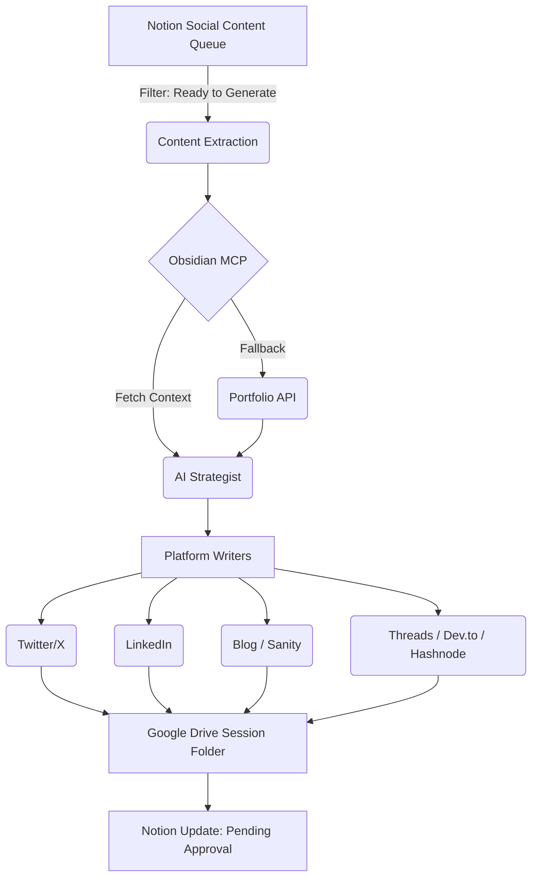
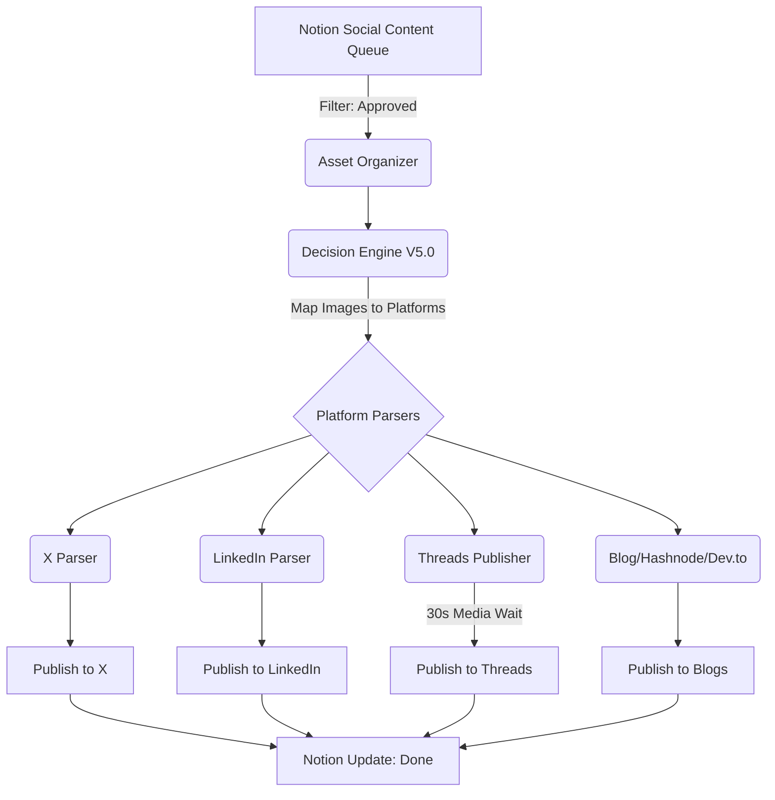
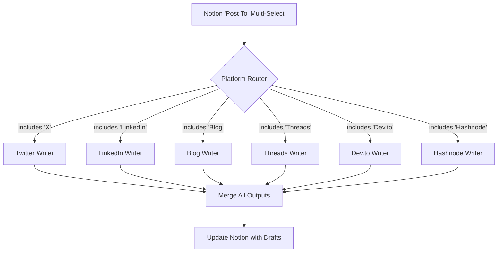

# 02. Architecture and Flow

This document details the high-level system architecture, operational topology, and foundational data flow of the Omni-Post AI Automation engine.

## High-Level Design

The system consists of two independent workflows to prevent fragility and establish a Human-in-the-Loop (HITL) review gate.

*(See **Diagram A: End-to-End Lifecycle** below for the full operational flow)*


### Part 1: Content Generation (28 nodes, 48-80 seconds)


```text
Notion – Get Ready Content (Trigger)
  → Code – Select Content & Profile (Session initialization)
  → Code – Extract & Process Content (Hierarchical, 3-4 levels deep)
  → AI Agent – Obsidian Context Overlay (Fetches dynamic daily context via Obsidian MCP Client)
  → Context - Fetch Portfolio (Baseline context)
  → Context - Standardize & Filter (Gemini Flash reduction)
  → Code – Personal Context Builder (Voice, Pillars, Positioning)
  → AI Agent – Research (Tavily Market Intelligence)
  → Code – CONTEXT MERGER (Builds Master Context)
  → AI Agent – CONTENT STRATEGIST (Strategy + Narrative Arc via Gemini Pro)
  → [Platform] Content Generation (Twitter, LinkedIn, Blog, Threads, Dev.to, Hashnode in parallel)
  → Google Drive – Create Session Folder (Drafts & Image Tasklist)
  → Notion Update (Status: Pending Approval)
```



### Part 2: Content Distribution (46 nodes, 17-31 seconds)

*(See **Diagram B: S-Tier Routing & Decision Engine** below for detailed platform distribution logic)*


```text
Notion – Get Approved (Trigger)
  → Asset Organization (Session-based file matching)
  → Detect Images Needed vs Present (Decision Engine V5.0 image mapping)
  → Platform-Specific Parsing (e.g., LinkedIn Parser V6.0, Blog Parser V12.0)
  → Platform Distribution Loops (e.g., Loop - Threads Posts → HTTP Container → Wait 30s → Publish)
  → No-Op Branching (Graceful skip for unselected platforms)
  → Merge – All Platform Results (Partial success handling)
  → Notion Update (Status: Done + Live URLs)
```



---

## End-to-End User Lifecycle Flow


The true power of OmniPost is how little the human actually does. The entire system is driven by Notion status changes.

1. **Drafting (Human)**: You write a raw dump of ideas in your Notion Social Content Queue. You tag the platforms in the `Post To` multi-select field (e.g., X, LinkedIn, Threads).
2. **Triggering (Human)**: You change the Notion status from `Draft` to `Ready to Generate`.
3. **Generation (System - Part 1)**: n8n picks it up. It extracts your raw Notion blocks, fetches your current struggles/focus from Obsidian via MCP, and runs the AI Strategist. The platform writers generate the drafts. Because Notion has a strict 2000-character limit per text block, n8n explicitly chunks the generated drafts and saves them directly into Notion rich text properties (e.g., `Twitter Draft`, `LinkedIn Draft`). Google Drive is used *only* to create a session folder for images.
4. **Status Sync (System)**: n8n changes the Notion status to `Pending Approval`.
5. **Review & Media (Human)**: You review and edit the drafts seamlessly within Notion. You then generate the required images via your local brand design skills, name them `asset-1`, `asset-2`, etc., and drop them into the dedicated Google Drive session folder.
6. **Approval (Human)**: You change the Notion status to `Approved`.
7. **Distribution (System - Part 2)**: n8n detects the approval. The Decision Engine maps your images to the right posts, parses the markdown into platform-specific API payloads, and publishes them concurrently.
8. **Completion (System)**: n8n updates the Notion record with live URLs and changes the status to `Done`.

---

## Key Architectural Decisions

### 1. Bi-Part Workflow Separation & The Approval Gate

**Why:** A single monolithic workflow was too fragile. One API failure meant starting over. More importantly, automated publishing of AI-generated content is dangerous without editorial oversight.

**Decision:** Split the system into two independent workflows separated by a Human-in-the-Loop (HITL) review gate.
- **Part 1 (Generation):** Creates drafts, stores them in Drive, and updates Notion status to `Pending Approval`.
- **Part 2 (Distribution):** Only triggers when a human explicitly changes the status to `Approved`.

**Result:** 
- The split exists to prevent accidental publishing.
- Supports manual editorial review (polishing the drafts).
- Isolates generation failures from distribution failures.

### 2. Session-Based Architecture

**Why:** Flat file storage caused file mixing, 15% failures, and manual cleanup.

**Decision:** Every content piece gets unique session ID for concurrent execution safety:

```javascript
const sessionId = `session_${Date.now()}_${notionId.substring(0, 8)}`;
```

Folder structure:
```
Notion Database (Social Content Queue)
└─ Entry: "Build in Public Case Study"
   ├─ Twitter Draft: [Chunked Text]
   ├─ LinkedIn Draft: [Chunked Text]
   ├─ Threads Draft: [Chunked Text]
   ├─ Blog Draft: [Chunked Text]
   └─ Image Tasklist: [Text]

Google Drive/
└─ session_1731234567890_abc12345_Build-in-Public/
   ├─ asset-1-session_1731234567890_abc12345.png
   └─ asset-2-session_1731234567890_abc12345.png
```

**Result:** Zero cross-contamination in 1000+ executions, concurrent execution safety, easy debugging. Every file traceable to original Notion item.

### 3. Platform Selection Architecture (New in v4.2)

**The Problem:** Not every content piece needs to go to all platforms. Sometimes you want a tweet-only update or a blog-only deep dive.

**The Solution:** Selective platform routing with graceful fallbacks.



**How It Works:**
Each platform has a dedicated IF node that checks `property_post_to.includes('<Platform>')`. Selected platforms run through the full AI generation pipeline. Unselected platforms hit a No-Op node returning a "skipped" status. A final Merge node collects all outputs (generated + skipped) and updates the Notion record.

**Result:** 40% reduction in processing time for single-platform posts. Zero wasted API calls.

### 4. Obsidian MCP Context Engine (v5.0)

**The Problem:** Stale context. Static prompts degrade in quality over time because they don't know what you are actively working on today.

**The Solution:** A local-first Obsidian Model Context Protocol (MCP) bridge.
The Obsidian SecondBrain is a massive local repository of the user's daily thoughts, projects, and execution logs. The Omni-Post AI agent dynamically queries this Second Brain vault *at runtime* via MCP (`AI Agent – Obsidian Context Overlay` node), using it as a highly relevant, real-time knowledge overlay over the static [Portfolio API](./12-Portfolio-API-Reference.md).
- Strict scope boxing (only reads `01-Me/CONTEXT.md`, `Projects/`, `Core/`, `Content Gen/`).
- Prioritized input normalization for determinism.
- Watchdog script for auto-recovery (`-32001` timeout prevention).

**Result:** Zero-cost, real-time dynamic context that injects live project struggles and metrics into the AI content generation pipeline, eliminating hallucinations. The system inherently "knows" what the user did yesterday without manual data entry.

### 5. Recursive Content Extraction

Notion content is hierarchical (3-4 levels deep). I use recursive tree traversal to preserve structure:

```javascript
function renderBlock(block, level = 0) {
  // Extract text and metadata
  const text = extractText(block.rich_text);
  
  // Type-specific rendering (15+ block types)
  switch (block.type) {
    case 'heading_1': return `\n# ${text}\n\n`;
    case 'code': return `\n\`\`\`${language}\n${text}\n\`\`\`\n\n`;
    case 'toggle': return `\n▶️ ${text}\n`;
    // ... 12+ more types
  }
  
  // Recursively process children
  if (block.children?.length) {
    return content + block.children.map(child => 
      renderBlock(child, level + 1)
    ).join('');
  }
}
```

**Result:**
- Full hierarchy preserved, AI receives organized content.
- Handles arbitrary nesting depth.
- Extracts images with metadata.
- Processes 100+ blocks in 3-5 seconds.
