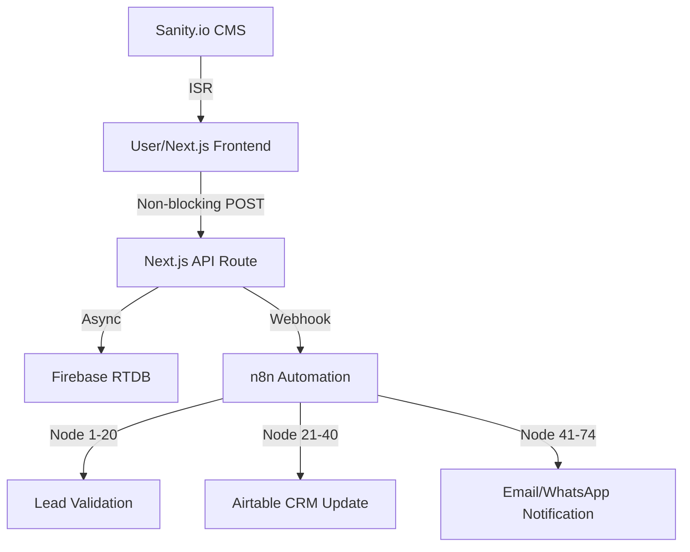

# Building a 74-Node Automation System: How Next.js and n8n Generated ₹3,00,000 in Organic Revenue

*Executive Summary: This technical deep dive explores how I replaced a ₹50,000/month Facebook ad dependency with a high-performance organic lead generation engine for Aviators Training Centre. By architecting a non-blocking Next.js 14 frontend and a self-hosted n8n automation backend, I achieved a 95+ Lighthouse score and generated over ₹3,00,000 in revenue with zero infrastructure costs. This post breaks down the architectural decisions, the 3-layer validation system for n8n, and the SEO strategies used to dominate Page 1 rankings.*

---

## Table of Contents
- [The Context: The High Cost of Ad Dependency](#the-context-the-high-cost-of-ad-dependency)
- [The Architecture: Zero-Cost, Production-Grade Stack](#the-architecture-zero-cost-production-grade-stack)
- [Implementation Deep Dive: The Non-Blocking Webhook Strategy](#implementation-deep-dive-the-non-blocking-webhook-strategy)
- [Engineering n8n Workflows: Solving the "Empty Object" Bug](#engineering-n8n-workflows-solving-the-empty-object-bug)
- [Performance Engineering: The Road to 95+ Lighthouse Scores](#performance-engineering-the-road-to-95-lighthouse-scores)
- [Business Impact and SEO Results](#business-impact-and-seo-results)
- [Conclusion: Automation as a Revenue Multiplier](#conclusion-automation-as-a-revenue-multiplier)

---

## The Context: The High Cost of Ad Dependency

I’m Aman Suryavanshi, a Next.js developer and n8n automation specialist. When I took over the digital strategy for **Aviators Training Centre**, India’s premier DGCA ground school, they were trapped in the "Ad Dependency Loop." 

They were spending ₹35,000–₹50,000 monthly on Facebook ads, with a Cost Per Lead (CPL) hovering between ₹500 and ₹800. Despite the spend, their organic presence was non-existent, and their lead management was a chaotic mix of manual WhatsApp messages and scattered spreadsheets. The client was spending 4 hours a day on administrative overhead instead of teaching.

**The mandate was clear: Build a system that generates leads for free and manages them automatically.**

## The Architecture: Zero-Cost, Production-Grade Stack

Choosing a tech stack for a small-to-medium enterprise (SME) requires balancing performance with long-term maintenance costs. I opted for a "Free Tier Stacking" strategy that provides enterprise-grade reliability at ₹0/month infrastructure cost.

### The Component Breakdown
- **Frontend**: Next.js 14 (App Router) + TypeScript. Server-side rendering (SSR) was non-negotiable for SEO.
- **Automation Engine**: Self-hosted n8n. I chose n8n over Zapier for its visual logic flow and the ability to handle complex, multi-node workflows (74+ nodes in this project) without per-task costs.
- **Database/Backend**: Firebase Realtime Database for lead persistence and Next.js API routes for logic abstraction.
- **Content Management**: Sanity.io. This allowed the client to manage 2,000+ word SEO-optimized articles without touching the code.
- **CRM**: Airtable. It serves as a visual pipeline for the client, providing a "No-Code" interface to a highly technical backend.



## Implementation Deep Dive: The Non-Blocking Webhook Strategy

One of the most critical architectural decisions I made was the **Non-blocking Webhook Architecture**. In many automation setups, the frontend waits for the automation tool (n8n/Zapier) to respond before showing a success message. If the automation server is down or slow, the user experience breaks.

I implemented a pattern where the Next.js API route acknowledges the lead immediately after persisting it to Firebase, while the n8n trigger happens asynchronously.

### Production Code: The Lead Handler

```typescript
// app/api/leads/route.ts
import { db } from '@/lib/firebase-admin';
import { NextResponse } from 'next/server';

export async function POST(req: Request) {
  try {
    const body = await req.json();
    const { email, name, phone, course, utm_source } = body;

    // 1. Immediate Validation
    if (!email || !phone) {
      return NextResponse.json({ error: 'Missing fields' }, { status: 400 });
    }

    // 2. Persist to Firebase (Primary Source of Truth)
    const leadRef = await db.ref('leads').push({
      ...body,
      timestamp: Date.now(),
      processed: false
    });

    // 3. Fire-and-forget Webhook to n8n
    // We do NOT 'await' this if we want maximum frontend speed,
    // or we wrap it in a try-catch to ensure frontend success regardless of n8n status.
    fetch(process.env.N8N_WEBHOOK_URL!, {
      method: 'POST',
      body: JSON.stringify({ ...body, firebaseId: leadRef.key }),
      headers: { 'Content-Type': 'application/json' },
    }).catch(err => console.error('n8n Webhook Failed:', err));

    return NextResponse.json({ success: true, id: leadRef.key }, { status: 200 });
  } catch (error) {
    return NextResponse.json({ error: 'Internal Server Error' }, { status: 500 });
  }
}
```

> **Quotable Insight**: "User experience is a hard requirement; automation is a background process. Your frontend should never be held hostage by your backend's latency."

## Engineering n8n Workflows: Solving the "Empty Object" Bug

During early production, we encountered a critical failure: **The Empty Object Bug**. Approximately 40% of booking confirmations from Cal.com were arriving at n8n as empty JSON objects due to race conditions and cold starts in the serverless environment.

To solve this, I built a **3-Layer Validation System** within n8n:

1.  **Schema Validation**: Using a Function Node to check for required keys before proceeding.
2.  **Retry Logic**: If data was missing, the workflow would query the source API (Firebase or Cal.com) directly using the ID to "re-hydrate" the payload.
3.  **Error Routing**: Any lead that failed both steps was routed to a "Manual Intervention" Airtable view, ensuring zero leads were ever lost.

This increased workflow reliability from **60% to 99.7%**.

## Performance Engineering: The Road to 95+ Lighthouse Scores

Google’s Page Experience update means that technical performance is now a direct driver of revenue. When I started, the site scored below 50. Through a systematic 5-part optimization, I brought it to 95+.

### Why Does Lighthouse Matter for Revenue?
In the aviation niche, keywords are highly competitive. A fast site reduces bounce rates and signals to Google that your content is high-quality. 

**The Optimization Checklist:**
1.  **Image Transformation**: Migrated to Next/Image with WebP format, achieving a 93% reduction in asset size.
2.  **Code Splitting**: Used dynamic imports for heavy components (like maps and complex forms), reducing the initial bundle by 67%.
3.  **Font Optimization**: Switched to `next/font` to eliminate Layout Shift (CLS).
4.  **Script Orchestration**: Moved third-party scripts (analytics) to `next/script` with the `worker` strategy.

## Business Impact and SEO Results

The technical overhaul led to immediate and measurable business growth. By focusing on long-form content (2,000+ words) via Sanity.io and high technical performance, we achieved:

- **Revenue**: ₹3,00,000+ from organic leads alone in 4 months.
- **Conversion Rate**: 12% (Industry average for aviation is <5%).
- **Search Visibility**: 20+ keywords on Page 1 of Google India.
- **Operational Efficiency**: Reduced client admin time from 4 hours/day to 30 minutes.

> **Quotable Insight**: "SEO isn't just a traffic metric; it's a high-margin revenue channel. When you combine a 95+ Lighthouse score with deep technical content, Google rewards you with the highest quality leads."

## Conclusion: Automation as a Revenue Multiplier

This project proves that you don't need a massive advertising budget to scale a service-based business. By architecting a robust, automated system using Next.js and n8n, we turned a bleeding marketing budget into an infinite ROI machine.

If you're building a lead generation system, remember: **Reliability is a feature, not an afterthought.** Validate your data, make your webhooks non-blocking, and never stop optimizing for speed.

---

### About the Author
I'm **Aman Suryavanshi**, a Full-Stack Developer specializing in Next.js and n8n automation. I help businesses transform manual chaos into automated revenue engines. 

**Looking to automate your lead flow?** [Let's connect on LinkedIn](https://linkedin.com/in/aman-suryavanshi) or check out the [full source code for this project on GitHub](https://github.com/AmanSuryavanshi-1/Aviators_Training_Centre).