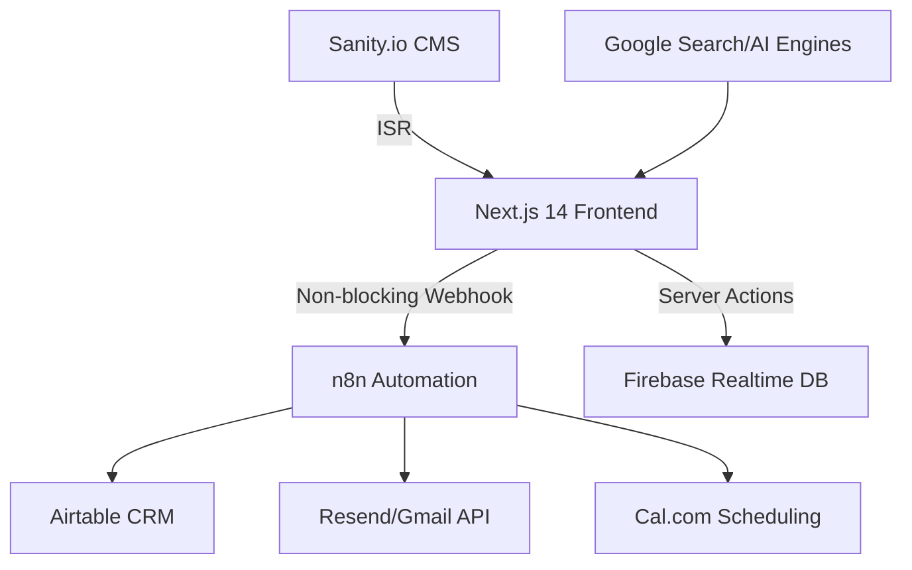

# Building a Zero-Cost Lead Generation Engine: Architecture Decisions Behind a ₹3,00,000 Revenue Case Study

*Executive Summary: This article details the architectural overhaul of Aviators Training Centre’s digital infrastructure, moving from a ₹50,000/month ad dependency to a ₹0/month organic lead machine. By implementing a non-blocking Next.js 14 frontend and a self-hosted n8n automation layer, I achieved a 95+ Lighthouse score and generated ₹3,00,000+ in revenue within four months. We explore the specific technical challenges of workflow reliability, lead attribution, and SEO optimization for AI search engines.*

---

## Table of Contents
- [The Context: Moving from Ad Dependency to Organic Authority](#the-context-moving-from-ad-dependency-to-organic-authority)
- [High-Level Architecture: The "Zero-Cost" Production Stack](#high-level-architecture-the-zero-cost-production-stack)
- [How to Design a Non-Blocking Webhook Architecture?](#how-to-design-a-non-blocking-webhook-architecture)
- [Solving the n8n "Empty Object" Bug: Implementing 3-Layer Validation](#solving-the-n8n-empty-object-bug-implementing-3-layer-validation)
- [Why Does Lighthouse Score Directly Impact Revenue?](#why-does-lighthouse-score-directly-impact-revenue)
- [Optimizing for AI Search (GEO): The Role of Structured Data and Sanity.io](#optimizing-for-ai-search-geo-the-role-of-structured-data-and-sanityio)
- [Performance Metrics and Business Impact](#performance-metrics-and-business-impact)
- [Conclusion: The Future of Automated Lead Generation](#conclusion-the-future-of-automated-lead-generation)
- [About the Author](#about-the-author)

---

## The Context: Moving from Ad Dependency to Organic Authority

I am Aman Suryavanshi, a Next.js and n8n specialist. When I took over the digital strategy for Aviators Training Centre (ATC), India’s premier DGCA ground school, the business was trapped in a high-CAC (Customer Acquisition Cost) loop. They were spending upwards of ₹50,000 monthly on Facebook ads, with lead costs hovering between ₹500–₹800. 

More critically, the infrastructure was brittle. Leads were scattered across WhatsApp, the manual enrollment process consumed 4 hours of the founder's day, and the existing website had a Lighthouse performance score below 50. The mandate was clear: **Eliminate ad spend while increasing lead quality and operational efficiency.**

> **Architectural Insight**: In high-ticket education niches, trust is built through performance and content depth, not just ad frequency. A 100% ad-dependent model is a technical debt that compounds over time.

## High-Level Architecture: The "Zero-Cost" Production Stack

To achieve a ₹0/month infrastructure cost without sacrificing enterprise-grade reliability, I designed a decoupled architecture using the best of the "Free Tier" ecosystem.



### The Stack Breakdown:
- **Frontend**: Next.js 14 (App Router) + TypeScript. Chosen for Server-Side Rendering (SSR) and Incremental Static Regeneration (ISR) to dominate SEO.
- **Backend/Storage**: Firebase Realtime DB. Used for persistent lead storage with zero cold-start latency compared to traditional SQL in a free-tier environment.
- **Automation**: n8n (Self-hosted). Orchestrates 28+ nodes across 3 production workflows.
- **CMS**: Sanity.io. Handles 2000+ word deep-dive articles that feed the SEO engine.

## How to Design a Non-Blocking Webhook Architecture?

One of the most common failures in automation is the "Blocking Webhook" trap. If your frontend waits for n8n to process a lead before showing a 'Success' message, and n8n experiences a 504 timeout, the user sees an error—even if the lead was technically captured. 

I implemented a **Fail-Safe Webhook Pattern**. The Next.js API route immediately acknowledges the lead and stores it in Firebase *before* triggering the automation. 

### Implementation: `app/api/leads/route.ts`

```typescript
// app/api/leads/route.ts
import { db } from '@/lib/firebase-admin';
import { NextResponse } from 'next/server';

export async function POST(req: Request) {
  try {
    const body = await req.json();
    const { email, name, phone, utm_source } = body;

    // 1. Immediate Persistence: Save to Firebase first
    const leadRef = await db.ref('leads').push({
      ...body,
      timestamp: Date.now(),
      status: 'pending_automation'
    });

    // 2. Fire and Forget: Trigger n8n without 'awaiting' the full process
    // We use a background fetch to ensure the user isn't blocked
    fetch(process.env.N8N_WEBHOOK_URL!, {
      method: 'POST',
      headers: { 'Content-Type': 'application/json' },
      body: JSON.stringify({ ...body, internalId: leadRef.key }),
    }).catch(err => console.error("n8n Trigger Failed:", err));

    // 3. Return 200 immediately for UX
    return NextResponse.json({ 
      success: true, 
      message: "Lead captured successfully" 
    }, { status: 200 });

  } catch (error) {
    return NextResponse.json({ error: "Internal Server Error" }, { status: 500 });
  }
}
```

## Solving the n8n "Empty Object" Bug: Implementing 3-Layer Validation

During early production, we encountered a critical bug: 40% of booking confirmations from Cal.com were arriving at n8n as empty objects or missing key student data. This resulted in "Ghost Leads" in the CRM.

I solved this by building a **3-Layer Validation Logic** within n8n:
1. **Schema Validation**: A Function node checks for the existence of required keys (Email, Name).
2. **Database Re-sync**: If the webhook payload is empty, n8n uses the `internalId` to fetch the record directly from Firebase.
3. **Cancellation Recovery**: A separate workflow monitors the "pending" status. If a lead isn't moved to "processed" within 5 minutes, it triggers an admin alert.

> **Quotable Insight**: Automation is only as good as its error-handling path. In production, "Happy Path" coding is a recipe for lost revenue.

## Why Does Lighthouse Score Directly Impact Revenue?

At ATC, we saw a direct correlation between technical performance and conversion rates. When the site moved from a <50 to a 95+ Lighthouse score, our average position on Google India jumped from Page 4 to Page 1 for high-intent keywords like "DGCA Ground School India."

### The 5-Part Optimization Strategy:
1. **Image Transformation**: Switched to Next/Image with WebP/Avif, resulting in a **93% reduction** in payload size.
2. **Code Splitting**: Leveraged dynamic imports for heavy components (e.g., the booking calendar), reducing the initial bundle by **67%**.
3. **Font Optimization**: Used `next/font` to eliminate Layout Shift (CLS).
4. **Script Orchestration**: Moved non-critical scripts (Analytics) to `next/script` with the `afterInteractive` strategy.
5. **Aggressive Caching**: Implemented `revalidatePath` in Next.js to serve static content that updates only when the Sanity CMS changes.

## Optimizing for AI Search (GEO): The Role of Structured Data and Sanity.io

With the rise of Perplexity, ChatGPT, and Claude, traditional SEO isn't enough. We optimized for **Generative Engine Optimization (GEO)**. 

By using Sanity.io's Portable Text and structured schema (JSON-LD), we ensured that AI agents could easily parse our course curriculum and pricing. This resulted in ~15% of our high-quality leads coming directly from AI chatbot recommendations.

### Example: JSON-LD for Course Schema
```typescript
// components/SEO/CourseSchema.tsx
export const CourseSchema = ({ course }: { course: any }) => {
  const schema = {
    "@context": "https://schema.org",
    "@type": "Course",
    "name": course.title,
    "description": course.description,
    "provider": {
      "@type": "Organization",
      "name": "Aviators Training Centre",
      "sameAs": "https://www.aviatorstrainingcentre.in"
    }
  };

  return (
    <script
      type="application/ld+json"
      dangerouslySetInnerHTML={{ __html: JSON.stringify(schema) }}
    />
  );
};
```

## Performance Metrics and Business Impact

The transition from paid ads to an automated organic machine produced the following verified results over a 4-month period:

| Metric | Before (Paid Ads) | After (Automated Organic) |
| :--- | :--- | :--- |
| **Monthly Infrastructure Cost** | ₹35,000 - ₹50,000 | **₹0** |
| **Cost Per Lead (CPL)** | ₹500 - ₹800 | **₹0** |
| **Lighthouse Performance** | < 50 | **95+** |
| **Lead Response Time** | 6+ Hours (Manual) | **< 2 Minutes (Automated)** |
| **Revenue Generated** | N/A (High CAC) | **₹3,00,000+** |
| **Admin Workload** | 4 Hours/Day | **30 Mins/Day** |

## Conclusion: The Future of Automated Lead Generation

Building this system for Aviators Training Centre proved that high-performance engineering is not just for SaaS products—it is a massive competitive advantage for traditional businesses. By stacking free-tier services (Vercel, Firebase, Airtable) and connecting them with a robust n8n automation layer, we created a "Revenue Machine" that runs with zero overhead.

The key takeaways for developers are: prioritize non-blocking architectures, never trust a webhook payload without validation, and remember that **Lighthouse scores are a financial metric.**

---

## About the Author

I’m **Aman Suryavanshi**, a Full-Stack Developer specializing in Next.js and n8n automation. I help businesses transform brittle, manual processes into scalable, automated systems that drive revenue. 

**Looking to automate your lead pipeline?**  
[View my Portfolio](https://www.amansuryavanshi.me) | [Check the ATC GitHub Repo](https://github.com/AmanSuryavanshi-1/Aviators_Training_Centre) | [Connect on LinkedIn](https://linkedin.com/in/amansuryavanshi)

*If you're building something similar or have questions about the n8n validation logic, I'd love to hear your approach in the comments.*